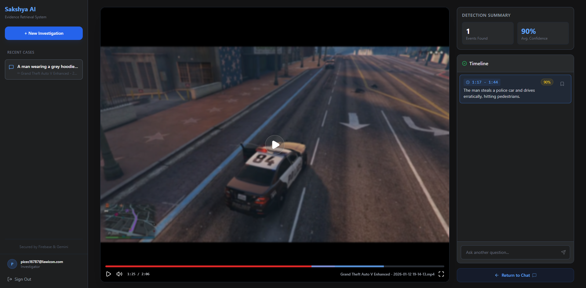
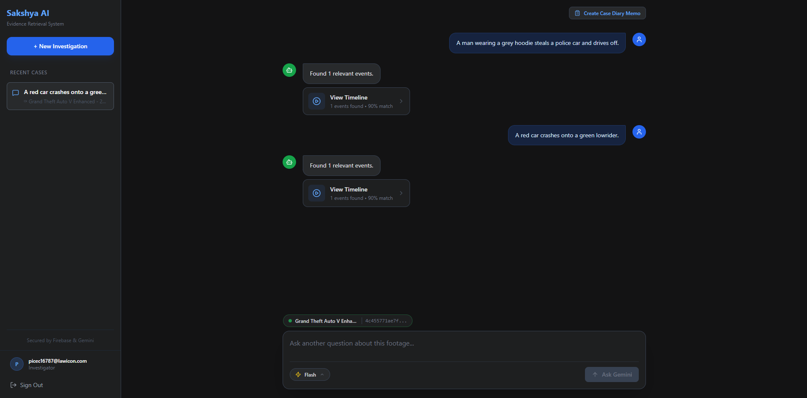
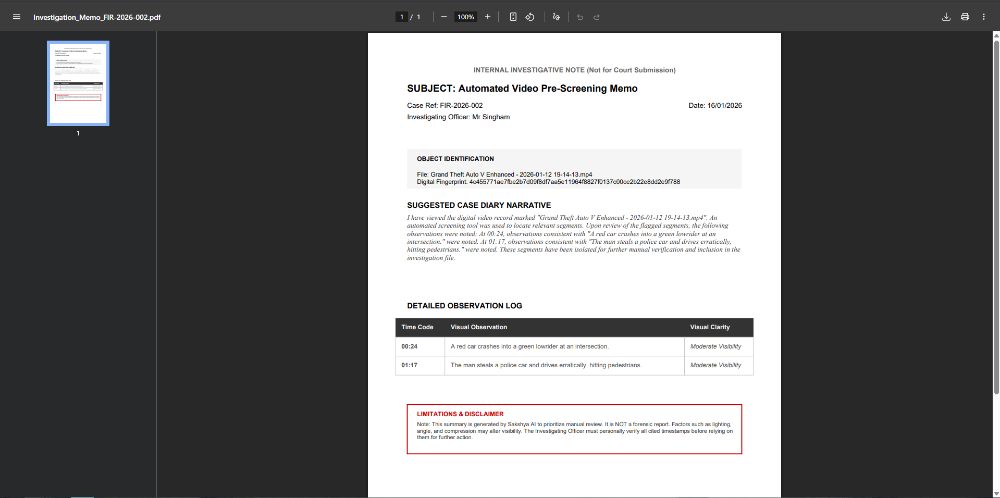

# Sakshya AI
Sakshya AI is an automated evidence retrieval system designed to handle the massive influx of video data mandated by India's new BNSS laws. By leveraging Gemini, the platform "watches" and indexes hours of raw CCTV or mobile footage, allowing Investigation Officers to pinpoint specific visual events—like a "white SUV with a dent"—simply by describing them. This is powered by a Firebase backend that enables a zero-copy architecture, allowing us to stream gigabytes of high-definition video directly from Firebase Storage to the AI without the latency of downloading files to a server. Finally, we close the legal loop by auto-generating cryptographic SHA-256 hashes for every file, ensuring that the evidence is not just found quickly, but remains secure, tamper-proof, and legally admissible under BSA Section 63 standards.

## Running this project
1. Clone and open the project in a folder.
2. You will require web app check, email-password authentication, firebase storage and firestore in your firebase project. First add in a .env file with your firebase configuration:
  ```
  VITE_FIREBASE_API_KEY=your_api_key
  VITE_FIREBASE_AUTH_DOMAIN=your_auth_domain
  VITE_FIREBASE_PROJECT_ID=your_project_id
  VITE_FIREBASE_STORAGE_BUCKET=your_storage_bucket
  VITE_FIREBASE_MESSAGING_SENDER_ID=your_sender_id
  VITE_FIREBASE_APP_ID=your_app_id
  VITE_FIREBASE_MEASUREMENT_ID=your_measurement_id
  VITE_FIREBASE_APPCHECK_DEBUG_TOKEN=your_debug_token
  ```
and modify the ReCaptcha site key to your site key under `src/lib/firebase.ts`

3. Run `npm install` followed by `npm run build`
4. Open the displayed link in your browser.

## Screenshots






## Credits
- Simon Binu
- Seraphin J Raphy
- Johan Abraham